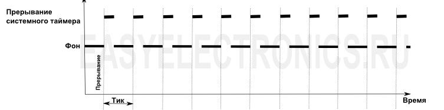
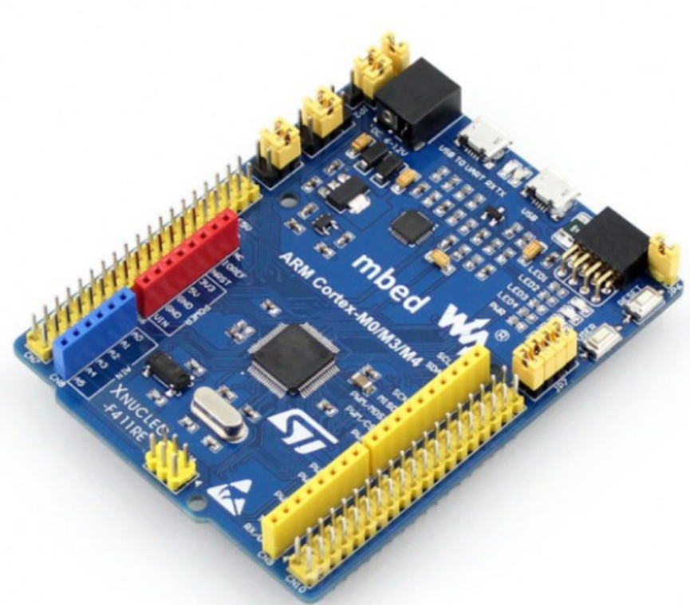
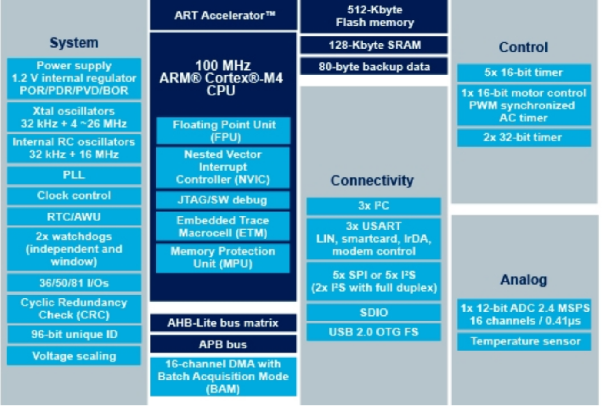
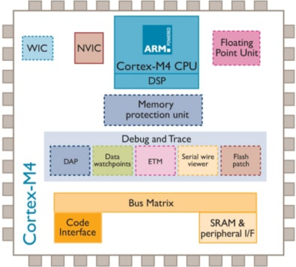
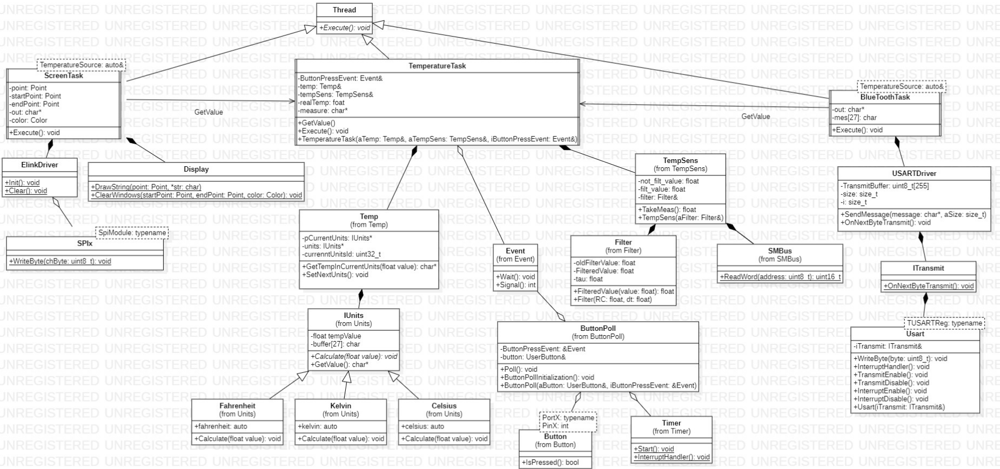
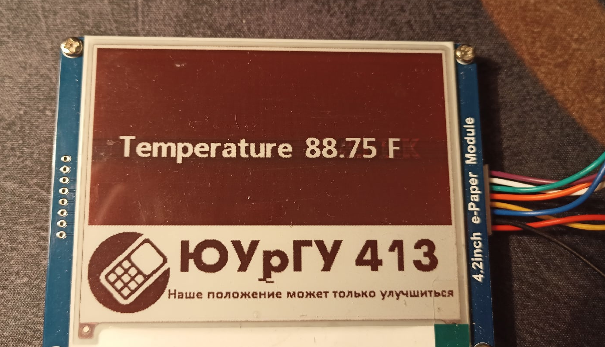
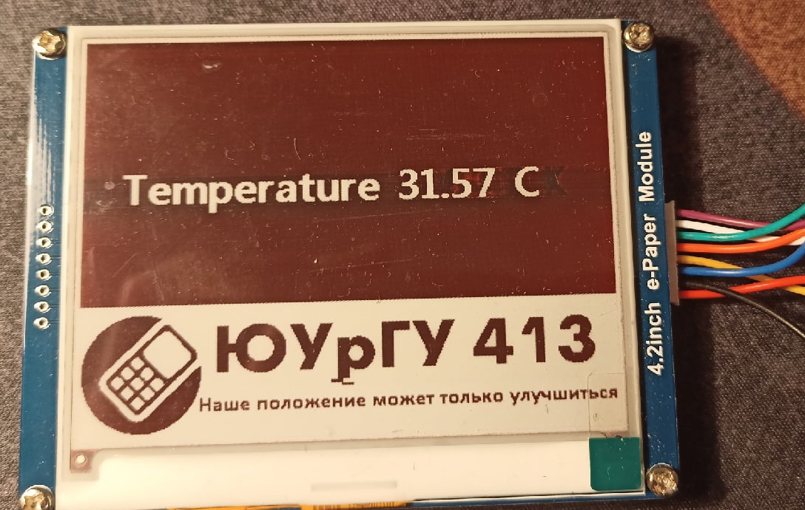
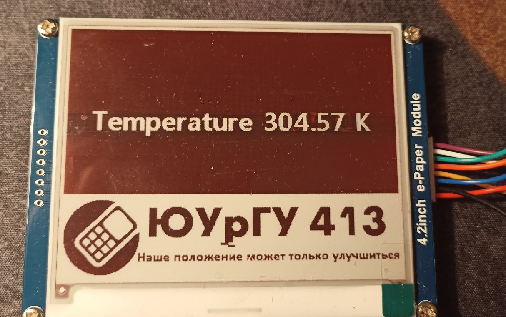
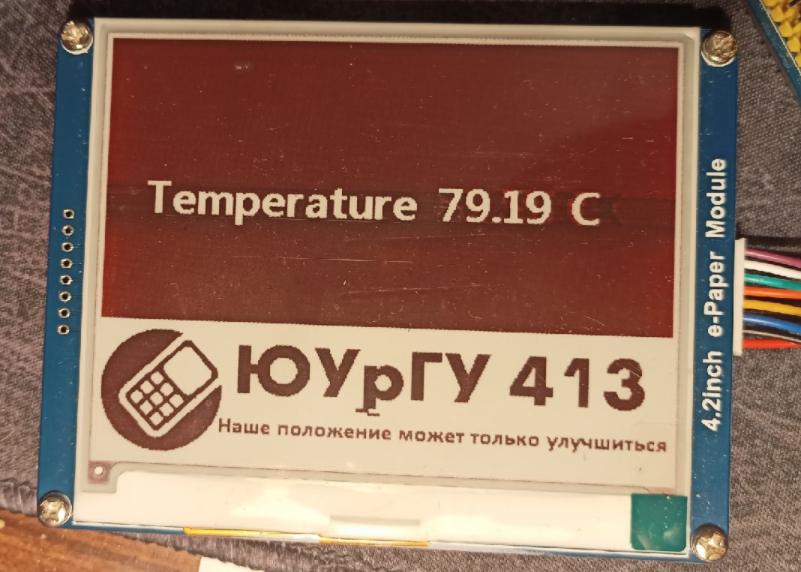
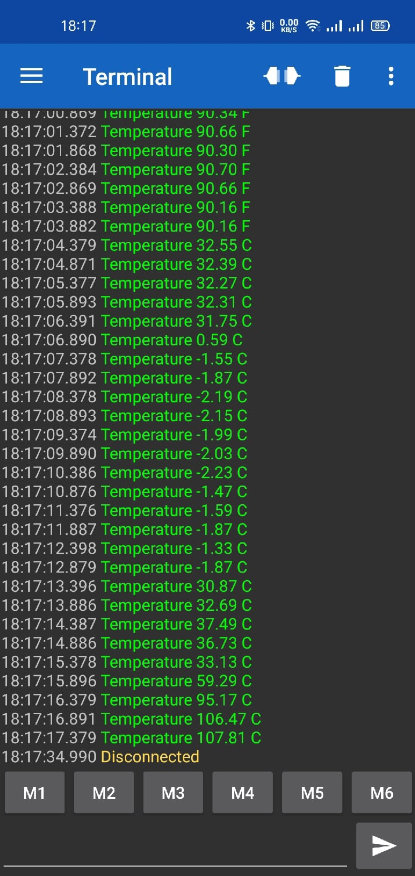

== Отчет по курсовому проекту
==== Тема:  Разработка датчика бесконтактного измерения температуры с передачей параметров по беспроводному интерфейсу
==== Дисциплина: Программное обеспечение измерительных процессов

Выполнили:
----
Ермохин Андрей Алексеевич КЭ-413
Шундеев Константин Павлович КЭ-413
----
Проверил:
----
Колодий Сергей Владимирович
----

== Введение
=== Язык программирования C++
С++ (_далее С+_) - компилируемый строго типизированный язык
программирования общего назначения. Поддерживает разные парадигмы программирования:

* процедурную,
* обобщённую,
* функциональную.

Наибольшее внимание уделено поддержке объектно-ориентированного программирования (*ООП*).

Разработка языка началась в _1979_ году. Целью создания *C+* было
дополнение языка *C* возможностями, удобными для масштабной разработки ПО,
с сохранением гибкости, скорости и портабельности языка программирования *C*.
Вместе с тем создатели
*C+* стремились сохранить совместимость с *C*: синтаксис первого основан на
синтаксисе последнего, и большинство программ на *C* будут работать и как *C+*.
Изначально новый язык назывался “C с классами”, но затем имя было изменено на
*C+* — это должно было подчеркнуть
как его происходжение от *C*, так и его превосходство над последним.

Первый выпуск *C+* для коммерческого использования состоялся в _1985_ году,
вместе с публикацией книги *“The C+ Programming Language”*,
которая на долгое время стала его неофициальным стандартом.
В _1989_ году вышла вторая версия языка в сопровождении книги
*“The Annotated C++ Reference Manual”*.

В _1990-х_ годах язык стал одним из наиболее широко используемых
языков программирования общего назначения.
Первым официальным стандартом языка стал
_ISO/IEC 14882:1998_, более известный как
_C+98_. В 2003 году была принята его дополненная версия,
C+03, а в 2005 году был опубликован *“Library Technical Report 1”*
(сокращенно *TR1*) — документ, описывающий расширения стандартной библиотеки.
*TR1* не является стандартом, но большинство актуальных компиляторов _C+_ поддерживает его.
 Наконец, в _2011_ году был принят текущий стандарт, _C+11_.

=== Объектно-ориентированное программирование

Объектно-ориентированное программирование (*ООП*) позволяет разложить проблему на
составные части, каждая из которых становится самостоятельным _объектом_.
Каждый из объектов содержит свой собственный код и данные, которые относятся к этому _объекту_.

Любая программа, написанная посредством *ООП*, отражает в своих данных
состояние физических предметов либо абстрактных понятий – _объектов_
программирования, для работы, с которыми она предназначена.

Все данные об объекте программирования и его связях с другими
_объектами_ можно объединить в одну структурированную переменную.
В первом приближении ее можно назвать _объектом_.

С _объектом_ связывается набор действий, иначе называемых _методами_.
С точки зрения языка программирования набор действий или _методов_ –
это функции, получающие в качестве обязательного параметра указатель
на _объект_ и выполняющие определенные действия с данными _объекта_ программирования.
Технология *ООП* запрещает работать с объектом иначе, чем через _методы_, таким образом,
внутренняя структура объекта скрыта от внешнего пользователя.

Описание множества однотипных объектов называется _классом_.

*Объект* – это структурированная переменная, содержащая всю информацию
о некотором физическом предмете или реализуемом в программе понятии.

*Класс* – это описание множества объектов программирования (объектов)
и выполняемых над ними действий.

_Класс_ можно сравнить с чертежом, согласно которому создаются объекты.
Обычно _классы_ разрабатывают таким образом, чтобы их объекты соответствовали
объектам предметной области решаемой задачи.

=== Основные понятия объектно-ориентированного программирования

Любая функция в программе представляет собой _метод_ для _объекта_ некоторого класса.

_Класс_ должен формироваться в программе естественным образом, как только в ней возникает
необходимость описания новых объектов программирования. Каждый новый шаг в разработке
алгоритма должен представлять собой разработку нового класса на основе уже существующих.

Вся программа в таком виде представляет собой объект некоторого класса
с единственным методом **run** (_выполнить_).

Программирование _«от класса к классу»_ включает в себя ряд новых
понятий. Основными понятиями *ООП* являются:

* инкапсуляция;
* наследование;
* полиморфизм.

*Инкапсуляция* *данных*  – это механизм, который объединяет данные и код,
манипулирующий с этими данными, а также защищает и то, и другое
от внешнего вмешательства или неправильного использования. В *ООП* код и данные могут быть
объединены вместе (в так называемый _«черный ящик»_) при создании _объекта_.

Внутри объекта код и данные могут быть _закрытыми_ или _открытыми_.

_Закрытые_ код или данные доступны только для других частей того же самого объекта и,
соответственно, недоступны для тех частей программы, которые существуют вне объекта.

_Открытые_ код и данные, напротив, доступны для всех частей программы, в том числе
и для других частей того же самого объекта. Они представляют своего рода интерфейс
для работы с объектом из других частей программы.

*Наследование* гласит о том, что новый, или производный класс может быть
определен на основе уже имеющегося, или базового класса.

При этом новый _класс_ сохраняет все свойства старого: данные _объекта_ базового класса включаются
в данные объекта производного, а _методы_
базового _класса_ могут быть вызваны для _объекта_ производного _класса_,
причем они будут выполняться над данными включенного в него _объекта_ базового класса.

Иначе говоря, новый _класс_ наследует как данные старого класса, так и _методы_ их обработки.

Если объект наследует свои свойства от одного родителя, то говорят об *одиночном
наследовании*. Если объект наследует данные и методы от нескольких базовых классов,
то говорят о *множественном наследовании*.

*Полиморфизм* – это свойство, которое позволяет один и тот же идентификатор
(одно и то же имя) использовать
для решения двух и более схожих, но технически разных задач.

Целью _полиморфизма_, применительно к *ООП*, является использование
одного имени для задания действий, общих для ряда классов объектов.
Такой _полиморфизм_ основывается на возможности включения в данные объекта
также и информации о _методах_ их обработки (в виде указателей на функции).

Будучи доступным в некоторой точке программы, _объект_, даже при отсутствии
полной информации о его типе, всегда может корректно вызвать свойственные ему _методы_.

=== Операционная система реального времени

Операционные системы реального времени (*ОСРВ*, по англ. *RTOS*)  предназначены для
обеспечения интерфейса к ресурсам критических по времени систем реального времени.
Основной задачей в таких системах является своевременность (_timeliness_) выполнения
обработки данных.

*FreeRTOS* — многозадачная _операционная система реального времени_ (*ОСРВ*) для встраиваемых систем.

Важные понятия *RTOS*:

*Системный тик*

Один из таймеров микроконтроллера настраивают на генерацию системных тиков.
Один тик делается, обычно, раз в 1 мс, но можно и чаще или реже.
В зависимости от того какая реакция и дискретность системы нам нужна.

.Системный тик

__Каждый *tick* - это вызов прерывания таймера, в котором вызывается диспетчер, чьими усилиями
проворачиваются шестеренки ОС. __

*Задача*

*Основой* любой *RTOS* является _задача_. _Задача_ выглядит как функция которая
крутит бесконечный цикл делающий относительно простую процедуру.

*Планировщик задач*

*Планировщик* заботится о том, чтобы у каждой задачи все сохранялось и запоминалось:
_текущее положение, стек, переменные, регистры_ и с точки зрения _задачи_ ничего не
происходило.

Изначально задача не инициализирована, но в нужный момент пользователь создает её командой
*xTaskCreate(……)* где в длинном перечне аргументов мы указываем на нашу задачу,
ее приоритет, имя для отладки.

Пример кода:

[source, cpp]
----
 Rtos::CreateThread(screenTask, "screenTask", ThreadPriority::normal);
----

=== Среда разработки программ для микроконтроллера

*Интегрированная среда разработки* - комплекс программных средств, используемый программистами
для разработки программного обеспечения.

*IAR Embedded Workbench* — это интегрированная отладочная среда разработки приложений (*IDE*),
обладающая рядом неоспоримых преимуществ.

--
За последние время в среде разработки *IAR Embedded* был сделан огромный скачок с точки зрения
удобства использования, так и с точки зрения поддержки современных стандартов. Так версия 8.X
получила поддержку стандарта _С+14_, а начиная с версии 8.40 и поддержку стандарт _С+17_ и это
является огромным плюсом для разработки надежного, понятного и качественно _ПО_.

В таблице 1 приведены основные характеристики *IAR Embedded Workbench*

--

.Характеристики IAR Embedded Workbench
[options="header"]
|=====================
|Характеристика|IAR Embedded Workbench
|Языки               |С/C++
|Стандарты языка     |С++ 17 начиная с версии 8.40
|Оптимизация кода    |Да, кроме condition_variable, future, mutex, shared_mutex, thread, поддержка
atomic урезана и реализована только для типов для которых есть аппаратная поддержка atomic
специальными командами в микроконтроллерах
|Контроль размера стека  |Да
|Поддержка RTOS  |Да
|Статический анализатор кода с набором правил |Да - MISRAC++2008, SECURITY,CERT, STDCHECKS
|Динамический анализ кода  |C-RUN
|Сертификация и проверка соответствию стандартам безопасности  |Сертификация на безопасность по стандартам IEC 61508 и ISO 26262 экспертной организацией TUV SUD – SIL3 сертификат
|Поддержка микроконтроллера STM32F411 RE |Полная
|=====================

== Отладочная плата
[cols="a, a"]
|===
| * *STM32F411RET6 ядро:* ARM® 32-bit Cortex™-M4 |  * *CP2102:* USB - UART преобразователь
| * *Arduino разъем:* для подключения Arduino шилдов ​| * *ICSP interface:* Arduino ICSP
| * *USB разъем:* USB коммуникационный интерфейс| * *SWD interface:* для программирования и отладки
| * *ST Morpho разъемы:*  для упрощения расширения​| * ​*6-12 V DC вход питания*
| * *Пользовательская кнопка* | *​ *Кнопка Сброса*
| * *Индикатор питания* | * *Пользовательские светодиоды*
| * *Индикаторы последовательного порта Rx/Tx* ​| *8 MHz кварцевый резонатор*
| * *32.768 KHz кварцевый резонатор* | http://www.waveshare.com/xnucleo-F411RE.htm
|===

.Отладочная плата

*Микроконтроллер ST32F411RE*

.Функциональные блоки микроконтроллера *STM32F411*

.Ядро Cortex-M4

* Ядро *Cortex* построено по __гарвардской архитектур__е с разделением шины данных и кода. ​

* Ядро *Cortex-М4* поддерживает _8/16/32-разрядные_ операции умножения, которые выполняются за 1 цикл (деление со знаком (SDIV) или без (UDIV) занимает от 2 до 12 тактов в зависимости от размера операндов​

* Ядро *Cortex-М4* поддерживает _8/16/32-разрядные_ операции умножения со сложением​

=== Характеристики ядра CortexM4

[cols="4,4,4,4"]
|===
| Параметр​ | ARM7TDMI​ | ARM Cortex-M3​| ARM Cortex-M4​
| Архитектура​ | ARMv4T (Фон Неймана)​ | ARMv7 (Гарвардская)​ | ARMv7 (Гарвардская)​
| Набор инструкций​ | Thumb/ARM​ | Thumb/Thumb-2​ | Thumb/Thumb-2, DSP, SIMD, FP​
| Конвейер​ |  3 уровня​ | 3 уровня + предсказание ветвлений​ | 3 уровня + предсказание ветвлений​
| Прерывания​ | FIQ/IRQ​ | NMI (немаскируемые) + от 1 до 240 физических источников прерываний​ | NMI (немаскируемые) + от 1 до 240 физических источников прерываний​
| Длительность входа в обработчик прерывания​ |  24-42 цикла​ | 12 циклов​ | 12 циклов​
| Длительность переключения между обработчиками прерываний​ | 24 цикла​ | 6 циклов​ | 6 циклов​
| Режимы пониженного энергопотребления​ | Нет​ | Встроены​ | Встроены​
| Защита памяти​ | Нет​ | Блок защиты памяти с 8 областями​ | Блок защиты памяти с 8 областями​
| Производительность по тесту Dhrystone​ | 0,95 DMIPS/МГц |  1,25 DMIPS/МГц​ | 1,25 DMIPS/МГц​
| Энергопотребление ядра​ | 0,28 мВт/МГц​ | 0,19 мВт/МГц​ | 0,19 мВт/МГц​
| Аппаратный модуль работы с плавающей точкой ​| нет​ | нет​ | есть​
|===

==== Характеристики микроконтроллера
[.notes]
--
Микроконтроллер имеет следующие характеристики:
--
[cols="a, a"]
|===
| *	32 разрядное ядро ARM Cortex-M4 | *	Блок работы с числами с плавающей точкой FPU
| *	512 кБайт памяти программ | *	128 кБайт ОЗУ
| * Встроенный 12 битный 16 канальный АЦП | *	DMA контроллер на 16 каналов
| *	USB 2.0 | *	3x USART
| * 5 x SPI/I2S | * 3x I2C
| * SDIO интерфейс для карт SD/MMC/eMMC | * Аппаратный подсчет контрольной суммы памяти программ CRC
| *	6 - 16 разрядных и 2 - 32 разрядных Таймера | *	1 - 16 битный для управления двигателями
| *	2  сторожевых таймера | *	1 системный таймер
| *	Работа на частотах до 100Мгц |* 81 портов ввода вывода
| *	Питание от 1.7 до 3.6 Вольт | * Потребление 100 мкА/Мгц
|===

=== Дополнительные особенности микроконтроллера

*	Настраиваемые источники тактовой частоты;
*	Настраиваемые на различные функции порты;
*	Внутренний температурный сенсор;
*	Таймеры с настраиваемым модулем *ШИМ*;
*	*DMA* для работы с модулями (*SPI*, *UART*, *ADC*… );
*	12 разрядный *ADC* последовательного приближения;
*	Часы реального времени;
*	Системный таймер и спец. прерывания для облегчения и ускорения  работы *ОСРВ*.

==== Требования к разработке:
* Для разработки должна использоваться отладочная плата *XNUCLEO-F411RE*;
* Питание платы должно быть автономным и подаваться с солнечный батарей;
* Программное обеспечение должно измерять температуру:
** Период измерения должен быть 100 ms.
** К измеренной температуре должен быть применен цифровой фильтр вида: +
stem:[tau = int  ((1-e^(-dt/(R*C)), RC > 0 sec), (1, RC<= 0 sec))] +
{nbsp} +
stem:["FilteredValue" = "OldFiltered" + ("Value" - "OldValue") * tau], +
{nbsp} +
где dt -  100 мс; +
Value – текущее нефильтрованное измеренное значение температуры; +
oldValue -  предыдущее фильтрованное значение.
** Для измерения температуры должен использоваться датчик инфракрасный датчик температуры *MLX90614*;
** Общение с датчиком должно осуществляться по интерфейсу *SMBus*;
* Вывод значений температуры должен производиться на экран с жидкими чернилами *4.2 inch e-Paper Module*;
** Общение с индикатором должно осуществляться через интерфейс *SPIx* (где х - любой не равный 1,2,3)
** Период вывода информации на индикатор должен быть 3 секунды.
** формат вывода: +
"Температура: " XXX.XX [Units]
* Передача значений по беспроводному интерфейсу должна осуществляться через модуль *BlueTooth Bee HC-06*;
** Для подключения модуля BlueTooth должна использоваться плата **Accessories Shield** или *I/O Expansion Shield*;
** Период вывода информации через *BlueTooth* модуль должен быть 1 секунда;
** Общение с платой расширения должно осуществляться через USART2;
** формат вывода: +
*"Температура: " XXX.XX [Units]*
* Архитектура должна быть представлена в виде UML диаграмм в пакете Star UML;
* Приложение должно быть написано на языке С++ с использование компилятора ARM 8.40.2;
* При разработке должна использоваться Операционная Система Реального Времени FreeRTOS и С++ обертка над ней;
* По нажатию кнопки USER на плате XNUCLEO-F411RE единцы измерения температуры должны изменяться в следующей циклической последовательности F->K->C.

== *Перечень вопросов, подлежащих разработке:*

* В ходе работы необходимо разработать архитектуру программного обеспечения в виде диаграммы UML.
* В ходе работы необходимо разработать код программного обеспечения;
** Код должен соответствовать стандарту кодирования Стэнфордского университета;
* Работа программы должна быть продемонстрирована совместно с платой XNUCLEO-F411RE.
* Содержание работы должно соответствовать ГОСТ 19.402–78 «Единая система программной документации. Описание программы».
** работа должна быть оформлена в формате Asciidoc и выложена на Github

=  Архитектура проекта

.Архитектура проекта

= *Описание классов проекта:*

Проект включает в себя три активные задачи – *ScreenTask*, *TemperatureTask* и *BlueToothTask*.
Они наследуют
класс *Thread*, позволяющий выполнять их на операционной системе реального времени (*RTOS*).
[cols="a, a"]
|===
|Класс *TemperatureTask*
|является задачей. Раз в секунду получает значение температуры в градусах Цельсия с
инфракрасного датчика.
Кроме того, она меняет единицы измерения температуры, ели была нажата кнопка.

|Класс *ScreenTask* |является задачей. Раз в три секунды выводит значение
температуры на экран в текущих единицах измерения.

|Класс *BlueToothTask* | является задачей. Передает значение температуры в текущих единицах измерения по BlueTooth.

|Класс *Temp* |позволяет сменить единицы измерения температуры и получить значение температуры в текущих единицах.

|Класс *IUnits* |является интерфейсом. Предоставляет доступ к методам классов Fahrenheit, Kelvinи Celsius, в которых выполняется пересчет единиц измерения

|Класс *Display* |позволяет вывести полученное значение температуры на дисплей.

|Класс *ElinkDriver* |отвечает за инициализацию дисплея и очистку экрана.

|Класс *SPIx* |отвечает за передачу команд дисплею.

|Класс *Event* |отвечает за передачу сигнала при нажатии кнопки.

|Класс *ButtonPoll* |отвечает за инициализацию таймера и установление сигнала при нажатии кнопки.

|Класс *Button* |выполняет опрос кнопки на нажатие.

|Класс *Timer* |отвечает за настройкутаймера, запуск таймера и обработку прерывания.

|Класс *TempSens* |получает значение температуры и выполняет их фильтрацию.

|Класс *Filtеr* |фильтрует принятые значения.

|Класс *SMBus* |отвечает за коммуникацию с датчиком температуры.

|Класс *USartDriver* |отвечает за передачу данных по *USART*.

|Класс *ITransmit* |предоставляет доступ классу *Usart* к методу класса *USARTDriver*.

|Класс *Usart* |выполняет передачу данных по *USART*.
|===

== *Детальное описание структуры проекта*

---
Класс *TemperatureTask*

Класс является активной задачей. Отвечает за получение температуры с датчика один раз в секунду.

* Метод *Execute()* включает в себя бесконечный цикл, в котором опрашивается сигнал, устанавливаемый
по нажатию кнопки. Если кнопка была нажата, то производится смена текущих единиц измерения. Кроме
того, принимается значение температуры с датчика.

* Метод *GetValue()* возвращает значение температуры в текущих единицах измерения.

---

Класс *Temp*

* Метод *GetTempInCurrentUnits()* возвращает температуру в текущих единицах измерения.

* Метод *SetNextUnits()* устанавливает следующие единицы измерения.

---

Класс *IUnits*

* Класс является интерфейсом, позволяющим получить доступ к методу *Calculate()* классов *Fahrenheit*,
*Kelvin* и *Celsius*.

* Метод *GetValue()* возвращает рассчитанную температуру.

---

Классы *Fahrenheit*, *Kelvin* и *Celsius*

* Данные классы преобразуют принятое значение температуры к соответствующим единицам измерения с
помощью метода *Calculate()*.

---

Класс *Event*

* Класс позволяет отправить сигнал при возникновении события с помощью метода *Signal()*.

* Метод *Wait()* позволяет ожидать сигнал в течение заданного таймаута.

---

Класс *ButtonPoll*

* Метод *ButtonPollInitialization()* отвечает за инициализацию таймера.

* Метод *Poll()* отправляет сигнал при нажатии кнопки.

---

Класс *Timer*

* Метод *Start()* отвечает за настройку таймера.

* Метод *InterruptHandler()* является обработчиком прерывания по переполнению таймера.

---

Класс *TempSens*

* Метод *TakeMeas()* отвечает за получение значения температуры с датчика и его фильтрацию.

---

Класс *Filter*

* Метод *FilteredValue()* возвращает отфильтрованное значение температуры.

---

Класс *SMBus*

* Метод *ReadWord()* возвращает значение температуры с датчика.

---

Класс *BlueToothTask*

* Класс является активной задачей. В методе *Execute()* выполняется передача значений температуры
по *Bluetooth* каждую секунду.

---

Класс *USARTDriver*

* Метод *SendMessage()* отвечает за отправку сообщения по *USART*.

* Метод *OnNextByteTransmit()* отвечает за побайтовую передачу сообщения.

---

Класс *Itransmit*

* Класс является интерфейсом, предоставляющим доступ классу *Usart* к методу
*OnNextByteTransmit()* класса *USARTDriver*.

---

Класс *Usart*

* Метод *WriteByte()* записывает данные в регистр DR.

* Метод *InterruptHandler()* Проверяет флаги: Пуст ли регистр данных и разрешено ли прерывание по
передаче. Затем вызывает метод *OnNextByteTransmit()* интерфейса *iTransmit*.

* Методы *TransmitEnable()* и *TransmitDisable()* включают  и выключают передачу данных.

* Методы *InterruptEnable()* и *InterruptDisable()* разрешают и запрещают прерывания по передаче.

---

Класс *ScreenTask*

* Класс является активной задачей. В методе *Execute()* выполняется вывод значений
температуры на дисплей каждые три секунды.

---

Класс *ElinkDriver*

* Метод *Init()* отвечает за инициализацию дисплея.

* Метод *Clear()* отвечает за очистку всей области дисплея.

---

Класс *Display*

* Метод *DrawString()* отвечает за вывод принятого значения в заданной области дисплея.

* Метод *ClearWindows()* отвечает за очистку заданной области экрана.

---

Класс *SPIx*

* Метод *WriteByte()* отвечает за передачу принятого значения по *SPI*.

---

=== Демонстрация работы устройства

Были измерены средняя температура комнаты, температура продукта из морозильника и лампы накаливания.

.Вывод температуры на дисплей в F

.Вывод температуры на дисплей в С

.Вывод температуры на дисплей в K

.Измеренная температура лампы накаливания

.Измеренная температура продукта из морозильной камеры
image::photos/morozilka.png[]

Проверка передачи данных по *BlueTooth*:

.Передача данных по BlueTooth

По рисункам видно, что устройство работает корректно, а именно выводит температуру
на дисплей и также, передаёт по *BlueTooth*.

== Вывод по работе:

В ходе работы, было создано устройство, отображающее значение температуры на дисплей,
передающего его посредством *BlueTooth*, меняющего свои единицы измерения по кнопке (C -> К -> F).

