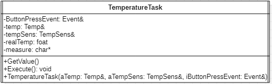
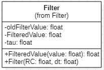
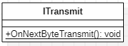
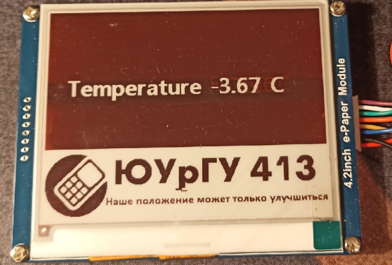

== Отчет по курсовому проекту
==== Тема:  Разработка датчика бесконтактного измерения температуры с передачей параметров по беспроводному интерфейсу
==== Дисциплина: Программное обеспечение измерительных процессов

Выполнили:
----
Ермохин Андрей Алексеевич КЭ-413
Шундеев Константин Павлович КЭ-413
----
Проверил:
----
Колодий Сергей Владимирович
----

== Введение
=== Язык программирования C++
С++ (_далее С+_) - компилируемый строго типизированный язык
программирования общего назначения. Поддерживает разные парадигмы программирования:

* процедурную,
* обобщённую,
* функциональную.

Наибольшее внимание уделено поддержке объектно-ориентированного программирования (*ООП*).

Разработка языка началась в _1979_ году. Целью создания *C+* было
дополнение языка *C* возможностями, удобными для масштабной разработки ПО,
с сохранением гибкости, скорости и портабельности языка программирования *C*.
Вместе с тем создатели
*C+* стремились сохранить совместимость с *C*: синтаксис первого основан на
синтаксисе последнего, и большинство программ на *C* будут работать и как *C+*.
Изначально новый язык назывался “C с классами”, но затем имя было изменено на
*C+* — это должно было подчеркнуть
как его происходжение от *C*, так и его превосходство над последним.

Первый выпуск *C+* для коммерческого использования состоялся в _1985_ году,
вместе с публикацией книги *“The C+ Programming Language”*,
которая на долгое время стала его неофициальным стандартом.
В _1989_ году вышла вторая версия языка в сопровождении книги
*“The Annotated C++ Reference Manual”*.

В _1990-х_ годах язык стал одним из наиболее широко используемых
языков программирования общего назначения.
Первым официальным стандартом языка стал
_ISO/IEC 14882:1998_, более известный как
_C+98_. В 2003 году была принята его дополненная версия,
C+03, а в 2005 году был опубликован *“Library Technical Report 1”*
(сокращенно *TR1*) — документ, описывающий расширения стандартной библиотеки.
*TR1* не является стандартом, но большинство актуальных компиляторов _C+_ поддерживает его.
 Наконец, в _2011_ году был принят текущий стандарт, _C+11_.

=== Объектно-ориентированное программирование

Объектно-ориентированное программирование (*ООП*) позволяет разложить проблему на
составные части, каждая из которых становится самостоятельным _объектом_.
Каждый из объектов содержит свой собственный код и данные, которые относятся к этому _объекту_.

Любая программа, написанная посредством *ООП*, отражает в своих данных
состояние физических предметов либо абстрактных понятий – _объектов_
программирования, для работы, с которыми она предназначена.

Все данные об объекте программирования и его связях с другими
_объектами_ можно объединить в одну структурированную переменную.
В первом приближении ее можно назвать _объектом_.

С _объектом_ связывается набор действий, иначе называемых _методами_.
С точки зрения языка программирования набор действий или _методов_ –
это функции, получающие в качестве обязательного параметра указатель
на _объект_ и выполняющие определенные действия с данными _объекта_ программирования.
Технология *ООП* запрещает работать с объектом иначе, чем через _методы_, таким образом,
внутренняя структура объекта скрыта от внешнего пользователя.

Описание множества однотипных объектов называется _классом_.

*Объект* – это структурированная переменная, содержащая всю информацию
о некотором физическом предмете или реализуемом в программе понятии.

*Класс* – это описание множества объектов программирования (объектов)
и выполняемых над ними действий.

_Класс_ можно сравнить с чертежом, согласно которому создаются объекты.
Обычно _классы_ разрабатывают таким образом, чтобы их объекты соответствовали
объектам предметной области решаемой задачи.

=== Основные понятия объектно-ориентированного программирования

Любая функция в программе представляет собой _метод_ для _объекта_ некоторого класса.

_Класс_ должен формироваться в программе естественным образом, как только в ней возникает
необходимость описания новых объектов программирования. Каждый новый шаг в разработке
алгоритма должен представлять собой разработку нового класса на основе уже существующих.

Вся программа в таком виде представляет собой объект некоторого класса
с единственным методом **run** (_выполнить_).

Программирование _«от класса к классу»_ включает в себя ряд новых
понятий. Основными понятиями *ООП* являются:

* инкапсуляция;
* наследование;
* полиморфизм.

*Инкапсуляция* *данных*  – это механизм, который объединяет данные и код,
манипулирующий с этими данными, а также защищает и то, и другое
от внешнего вмешательства или неправильного использования. В *ООП* код и данные могут быть
объединены вместе (в так называемый _«черный ящик»_) при создании _объекта_.

Внутри объекта код и данные могут быть _закрытыми_ или _открытыми_.

_Закрытые_ код или данные доступны только для других частей того же самого объекта и,
соответственно, недоступны для тех частей программы, которые существуют вне объекта.

_Открытые_ код и данные, напротив, доступны для всех частей программы, в том числе
и для других частей того же самого объекта. Они представляют своего рода интерфейс
для работы с объектом из других частей программы.

*Наследование* гласит о том, что новый, или производный класс может быть
определен на основе уже имеющегося, или базового класса.

При этом новый _класс_ сохраняет все свойства старого: данные _объекта_ базового класса включаются
в данные объекта производного, а _методы_
базового _класса_ могут быть вызваны для _объекта_ производного _класса_,
причем они будут выполняться над данными включенного в него _объекта_ базового класса.

Иначе говоря, новый _класс_ наследует как данные старого класса, так и _методы_ их обработки.

Если объект наследует свои свойства от одного родителя, то говорят об *одиночном
наследовании*. Если объект наследует данные и методы от нескольких базовых классов,
то говорят о *множественном наследовании*.

*Полиморфизм* – это свойство, которое позволяет один и тот же идентификатор
(одно и то же имя) использовать
для решения двух и более схожих, но технически разных задач.

Целью _полиморфизма_, применительно к *ООП*, является использование
одного имени для задания действий, общих для ряда классов объектов.
Такой _полиморфизм_ основывается на возможности включения в данные объекта
также и информации о _методах_ их обработки (в виде указателей на функции).

Будучи доступным в некоторой точке программы, _объект_, даже при отсутствии
полной информации о его типе, всегда может корректно вызвать свойственные ему _методы_.

=== Операционная система реального времени

Операционные системы реального времени (*ОСРВ*, по англ. *RTOS*)  предназначены для
обеспечения интерфейса к ресурсам критических по времени систем реального времени.
Основной задачей в таких системах является своевременность (_timeliness_) выполнения
обработки данных.

*FreeRTOS* — многозадачная _операционная система реального времени_ (*ОСРВ*) для встраиваемых систем.

Важные понятия *RTOS*:

*Системный тик*

Один из таймеров микроконтроллера настраивают на генерацию системных тиков.
Один тик делается, обычно, раз в 1 мс, но можно и чаще или реже.
В зависимости от того какая реакция и дискретность системы нам нужна.

.Системный тик
image::photos/Tick.png[]

__Каждый *tick* - это вызов прерывания таймера, в котором вызывается диспетчер, чьими усилиями
проворачиваются шестеренки ОС. __

*Задача*

*Основой* любой *RTOS* является _задача_. _Задача_ выглядит как функция которая
крутит бесконечный цикл делающий относительно простую процедуру.

*Планировщик задач*

*Планировщик* заботится о том, чтобы у каждой задачи все сохранялось и запоминалось:
_текущее положение, стек, переменные, регистры_ и с точки зрения _задачи_ ничего не
происходило.

Изначально задача не инициализирована, но в нужный момент пользователь создает её командой
*xTaskCreate(……)* где в длинном перечне аргументов мы указываем на нашу задачу,
ее приоритет, имя для отладки.

Пример кода:

[source, cpp]
----
 Rtos::CreateThread(screenTask, "screenTask", ThreadPriority::normal);
----

=== Среда разработки программ для микроконтроллера

*Интегрированная среда разработки* - комплекс программных средств, используемый программистами
для разработки программного обеспечения.

*IAR Embedded Workbench* — это интегрированная отладочная среда разработки приложений (*IDE*),
обладающая рядом неоспоримых преимуществ.

--
За последние время в среде разработки *IAR Embedded* был сделан огромный скачок с точки зрения
удобства использования, так и с точки зрения поддержки современных стандартов. Так версия 8.X
получила поддержку стандарта _С+14_, а начиная с версии 8.40 и поддержку стандарт _С+17_ и это
является огромным плюсом для разработки надежного, понятного и качественно _ПО_.

В таблице 1 приведены основные характеристики *IAR Embedded Workbench*

--

.Характеристики IAR Embedded Workbench
[options="header"]
|=====================
|Характеристика|IAR Embedded Workbench
|Языки               |С/C++
|Стандарты языка     |С++ 17 начиная с версии 8.40
|Оптимизация кода    |Да, кроме condition_variable, future, mutex, shared_mutex, thread, поддержка
atomic урезана и реализована только для типов для которых есть аппаратная поддержка atomic
специальными командами в микроконтроллерах
|Контроль размера стека  |Да
|Поддержка RTOS  |Да
|Статический анализатор кода с набором правил |Да - MISRAC++2008, SECURITY,CERT, STDCHECKS
|Динамический анализ кода  |C-RUN
|Сертификация и проверка соответствию стандартам безопасности  |Сертификация на безопасность по стандартам IEC 61508 и ISO 26262 экспертной организацией TUV SUD – SIL3 сертификат
|Поддержка микроконтроллера STM32F411 RE |Полная
|=====================

== Отладочная плата
[cols="a, a"]
|===
| * *STM32F411RET6 ядро:* ARM® 32-bit Cortex™-M4 |  * *CP2102:* USB - UART преобразователь
| * *Arduino разъем:* для подключения Arduino шилдов ​| * *ICSP interface:* Arduino ICSP
| * *USB разъем:* USB коммуникационный интерфейс| * *SWD interface:* для программирования и отладки
| * *ST Morpho разъемы:*  для упрощения расширения​| * ​*6-12 V DC вход питания*
| * *Пользовательская кнопка* | *​ *Кнопка Сброса*
| * *Индикатор питания* | * *Пользовательские светодиоды*
| * *Индикаторы последовательного порта Rx/Tx* ​| *8 MHz кварцевый резонатор*
| * *32.768 KHz кварцевый резонатор* | http://www.waveshare.com/xnucleo-F411RE.htm
|===

.Отладочная плата
image::photos/plata[]

*Микроконтроллер ST32F411RE*

.Функциональные блоки микроконтроллера *STM32F411*
image::photos/microcontroller.png[]

.Ядро Cortex-M4
image::photos/cortexm4.png[]

* Ядро *Cortex* построено по __гарвардской архитектур__е с разделением шины данных и кода. ​

* Ядро *Cortex-М4* поддерживает _8/16/32-разрядные_ операции умножения, которые выполняются за 1 цикл (деление со знаком (SDIV) или без (UDIV) занимает от 2 до 12 тактов в зависимости от размера операндов​

* Ядро *Cortex-М4* поддерживает _8/16/32-разрядные_ операции умножения со сложением​

=== Характеристики ядра CortexM4

[cols="4,4,4,4"]
|===
| Параметр​ | ARM7TDMI​ | ARM Cortex-M3​| ARM Cortex-M4​
| Архитектура​ | ARMv4T (Фон Неймана)​ | ARMv7 (Гарвардская)​ | ARMv7 (Гарвардская)​
| Набор инструкций​ | Thumb/ARM​ | Thumb/Thumb-2​ | Thumb/Thumb-2, DSP, SIMD, FP​
| Конвейер​ |  3 уровня​ | 3 уровня + предсказание ветвлений​ | 3 уровня + предсказание ветвлений​
| Прерывания​ | FIQ/IRQ​ | NMI (немаскируемые) + от 1 до 240 физических источников прерываний​ | NMI (немаскируемые) + от 1 до 240 физических источников прерываний​
| Длительность входа в обработчик прерывания​ |  24-42 цикла​ | 12 циклов​ | 12 циклов​
| Длительность переключения между обработчиками прерываний​ | 24 цикла​ | 6 циклов​ | 6 циклов​
| Режимы пониженного энергопотребления​ | Нет​ | Встроены​ | Встроены​
| Защита памяти​ | Нет​ | Блок защиты памяти с 8 областями​ | Блок защиты памяти с 8 областями​
| Производительность по тесту Dhrystone​ | 0,95 DMIPS/МГц |  1,25 DMIPS/МГц​ | 1,25 DMIPS/МГц​
| Энергопотребление ядра​ | 0,28 мВт/МГц​ | 0,19 мВт/МГц​ | 0,19 мВт/МГц​
| Аппаратный модуль работы с плавающей точкой ​| нет​ | нет​ | есть​
|===

==== Характеристики микроконтроллера
[.notes]
--
Микроконтроллер имеет следующие характеристики:
--
[cols="a, a"]
|===
| *	32 разрядное ядро ARM Cortex-M4 | *	Блок работы с числами с плавающей точкой FPU
| *	512 кБайт памяти программ | *	128 кБайт ОЗУ
| * Встроенный 12 битный 16 канальный АЦП | *	DMA контроллер на 16 каналов
| *	USB 2.0 | *	3x USART
| * 5 x SPI/I2S | * 3x I2C
| * SDIO интерфейс для карт SD/MMC/eMMC | * Аппаратный подсчет контрольной суммы памяти программ CRC
| *	6 - 16 разрядных и 2 - 32 разрядных Таймера | *	1 - 16 битный для управления двигателями
| *	2  сторожевых таймера | *	1 системный таймер
| *	Работа на частотах до 100Мгц |* 81 портов ввода вывода
| *	Питание от 1.7 до 3.6 Вольт | * Потребление 100 мкА/Мгц
|===

=== Дополнительные особенности микроконтроллера

*	Настраиваемые источники тактовой частоты;
*	Настраиваемые на различные функции порты;
*	Внутренний температурный сенсор;
*	Таймеры с настраиваемым модулем *ШИМ*;
*	*DMA* для работы с модулями (*SPI*, *UART*, *ADC*… );
*	12 разрядный *ADC* последовательного приближения;
*	Часы реального времени;
*	Системный таймер и спец. прерывания для облегчения и ускорения  работы *ОСРВ*.

==== Требования к разработке:
* Для разработки должна использоваться отладочная плата *XNUCLEO-F411RE*;
* Питание платы должно быть автономным и подаваться с солнечный батарей;
* Программное обеспечение должно измерять температуру:
** Период измерения должен быть 100 ms.
** К измеренной температуре должен быть применен цифровой фильтр вида: +
stem:[tau = int  ((1-e^(-dt/(R*C)), RC > 0 sec), (1, RC<= 0 sec))] +
{nbsp} +
stem:["FilteredValue" = "OldFiltered" + ("Value" - "OldValue") * tau], +
{nbsp} +
где dt -  100 мс; +
Value – текущее нефильтрованное измеренное значение температуры; +
oldValue -  предыдущее фильтрованное значение.
** Для измерения температуры должен использоваться датчик инфракрасный датчик температуры *MLX90614*;
** Общение с датчиком должно осуществляться по интерфейсу *SMBus*;
* Вывод значений температуры должен производиться на экран с жидкими чернилами *4.2 inch e-Paper Module*;
** Общение с индикатором должно осуществляться через интерфейс *SPIx* (где х - любой не равный 1,2,3);
** Период вывода информации на индикатор должен быть 3 секунды.
** формат вывода: +
"Температура: " XXX.XX [Units]
* Передача значений по беспроводному интерфейсу должна осуществляться через модуль *BlueTooth Bee HC-06*;
** Для подключения модуля BlueTooth должна использоваться плата **Accessories Shield** или *I/O Expansion Shield*;
** Период вывода информации через *BlueTooth* модуль должен быть 1 секунда;
** Общение с платой расширения должно осуществляться через USART2;
** формат вывода: +
*"Температура: " XXX.XX [Units]*
* Архитектура должна быть представлена в виде UML диаграмм в пакете Star UML;
* Приложение должно быть написано на языке С++ с использование компилятора ARM 8.40.2;
* При разработке должна использоваться Операционная Система Реального Времени FreeRTOS и С++ обертка над ней;
* По нажатию кнопки USER на плате XNUCLEO-F411RE единцы измерения температуры должны изменяться в следующей циклической последовательности F->K->C.

== *Перечень вопросов, подлежащих разработке:*

* В ходе работы необходимо разработать архитектуру программного обеспечения в виде диаграммы UML.
* В ходе работы необходимо разработать код программного обеспечения;
** Код должен соответствовать стандарту кодирования Стэнфордского университета;
* Работа программы должна быть продемонстрирована совместно с платой XNUCLEO-F411RE.
* Содержание работы должно соответствовать ГОСТ 19.402–78 «Единая система программной документации. Описание программы».
** работа должна быть оформлена в формате Asciidoc и выложена на Github

== Анализ требований к курсовой работе

*1) Для измерения температуры должен использоваться инфракрасный датчик температуры _MLX90614_*.

В роли инфракрасного датчика температуры должен выступать датчик *MLX90614*, поэтому следует узнать, что
это за устройство и просмотреть https://www.waveshare.com/wiki/Infrared_Temperature_Sensor[документацию] на датчик.
Исходя из просмотренной документации, выделили основные:

.Датчик MLX90614

*MLX90614* – это инфракрасный термометр в корпусе *TO-39* для бесконтактного
измерения температуры.

Датчики измеряют две температуры: _температуру объекта_ и _температуру окружающей среды_.
Измерение температуры объекта происходит _бесконтактным_ способом, а температура среды
измеряется на кристалле датчика.

Температура объекта измеряется в диапазоне от *-70* до *380* градусов с 17-битным разрешением
посредством считывания инфракрасного излучения, исходящего от него. Такая точность позволяет
датчику различать температуру между *25°С* и *25.02°С*.

[cols="a"]
|===
|Особенности и преимущества:

|Малые размеры, небольшая стоимость.
|Легкость интеграции.
|Заводская калибровка в широком температурном диапазоне: -40…125°С для датчика и -70…380°С для измеряемого объекта.
|Высокая точность 0.5°С в широком температурном диапазоне (0…50°С).
|Высокоточная (медицинская) калибровка.
|Разрешение измерений 0.02°С.
|SMBus совместимый интерфейс.
|ШИМ выход для получения непрерывных результатов измерений.
|Модели с напряжением питания 3 и 5 В.
|Модели с одной и двумя зонами (датчиками).
|Простая адаптация для приложений на 8-16В.
|Режим пониженного энергопотребления для экономии питания.
|Различные модификации корпуса для специализированного применения.
|===

Датчики *MLX90614* поддерживают два интерфейса, однако достаточно иметь один, чтобы
получить доступ к другому. Первичное подключение к *ИК* датчику происходит по 2-проводному
*SMBus* интерфейсу, очень простому и близкому к *I2С*. Если он уже настроен, то позже можно
сконфигурировать датчик на *ШИМ* выход.
Два выходных сигнала - *SDA* и *SCL* – передают данные и сигнал синхронизации.

*2) Общение с датчиком _MLX90614_ должно осуществляться по интерфейсу SMBus*.

Исходя из приведённой выше документации, было установлено, что для дальнейшей работы
с датчиком температуры *MLX90614* нам потребуется узнать о интерфейсе *SMBus*.

Шина *SMBus* (_System Management Bus_ - шина системного управления) является
двухпроводным интерфейсом для обмена данными между микросхемами различных системных
компонентов компьютера, а также связи их с самим компьютером. Основное назначение интерфейса -
управление подсистемой питания, мониторинг оборудования и сопутствующих подсистем.

*SMBus* основан на шине *I2C*, но использует более низкое сигнальное напряжение (3,3 В).

В микроконтроллере *STM32F411* существует аппаратный модуль поддержки интерфейса *SMBUS*.

Для считывания данных по *SMBus* необходимо произвести следующие действия:

1) Настроить модуль *SMBus*

Для настройки модуля необходимо произвести следующие действия:

* Подать тактирование на модуль *I2C* :

[source, cpp]
----
RCC::APB1ENR::I2C1EN::Enable::Set();
----

* Для переключения из режима I2C в режим SMBus необходимо установить бит *SMBus* в регистре *I2C_CR1*:

[source, cpp]
----
I2C1::CR1::SMBUS::SmBusMode::Set();
----

* Теперь необходимо указать тип устройства (*Host* или *Device*), в нашем случае - *Device*:

[source, cpp]
----
I2C1::CR1::SMBTYPE::Device::Set();
----

* Теперь укажем, какой режим *I2C* нам необходим (*fast* или *standard*), так как используем *SMBus*, нам будет достаточно
*Standard mode*:

[source, cpp]
----
I2C1::CCR::F_S::StandartMode::Set();
----

* Не отходя от регистра *CCR*, запишем значение частоты:

[source, cpp]
----
I2C1::CCR::CCR::Set(0xC8U);
----

* Скидываем биты частоты шины тактирования *APB1*:

[source, cpp]
----
I2C1::CR2::FREQ::Set(0x10);
----

* Установим *TRISE* должны обеспечивать максимальную продолжительность петли обратной связи
*SCL* в *Master* - режиме:

[source, cpp]
----
I2C1::TRISE::Write(0x11);
----

* Установим бит *PE*, чтобы включить периферию:

[source, cpp]
----
I2C1::CR1::PE::Enable::Set();
----

* Запишем бит *high* в выходной регистр данных:

[source,cpp]
----
GPIOB::ODR::ODR8::High::Set() ;
----

* Теперь необходимо произвести настройку портов, которые будут работать с нашим датчиком.

1) Переведём порты *B8*, *B9* в альтернативный режим;

2) Установим альтернативные функции *High* регистра *AFRH* *Scl* и *Sda*;

3) В регистре типа вывода порта *OTYPER*, также настроим на выход порты *B8* и *B9*;

4) Укажем высокую скорость (*high speed*) в регистре *OSPEEDR*;

5) И установим подтяжку к единице на данных портах.

[source,cpp]
----
  GPIOB::MODER::MODER8::Alternate::Set(); //Alternate moder 8
  GPIOB::MODER::MODER9::Alternate::Set(); //Alternate moder 9
  GPIOB::AFRH::AFRH8::Af4::Set();  //scl
  GPIOB::AFRH::AFRH9::Af4::Set();  //sda
  GPIOB::OTYPER::OT8::OutputOpenDrain::Set();
  GPIOB::OTYPER::OT9::OutputOpenDrain::Set();
  GPIOB::OSPEEDR::OSPEEDR8::HighSpeed::Set() ;
  GPIOB::OSPEEDR::OSPEEDR9::HighSpeed::Set() ;
  GPIOB::PUPDR::PUPDR8::PullUp::Set() ;
  GPIOB::PUPDR::PUPDR9::PullUp::Set() ;
----

Для того, чтобы считывать информацию с _ИК-датчика_, нам понадобится прописать функцию *ReadWord*.

Для этого понадобится соблюдать определенный порядок действий, а так как должно происходить приём двух
байт данных, то можно использовать такой алгоритм:

.Алгортим

Начнём с того, что данная функция должна принимать адрес поля, в котором
хранится значение температуры в _ИК-датчике_:

[source,cpp]
----
static uint16_t ReadWord(std::uint8_t address)
----

* Затем запустим модуль I2C:

[source,cpp]
----
I2C1::CR1::START::Enable::Set();
----

* Разрешим *ACK* для модуля *I2C*. Данный бит необходимо установить сразу, потому что потом он может не работать:

[source,cpp]
----
I2C1::CR1::ACK::Acknowledge::Set() ;
----

* Проверяем, установился ли стартовый бит:

[source,cpp]
----
    while(I2C1::SR1::SB::Value0::IsSet())
    {
    }
----

* Получаем данные с регистра *SR1*

[source, cpp]
----
I2C1::SR1::Get();
----

* В регистр *DR* передаём адрес *MLX90614* (если устройство одно, то адрес по умолчанию _0x00_)

[source, cpp]
----
I2C1::DR::Write(0x00);
----

* Проверяем, был ли согласован адрес *Master* с адресом *Slave* устройства:

[source, cpp]
----
while(I2C1::SR1::ADDR::Value0::IsSet())
{
}
----

* Получаем данные с регистров *SR1* и *SR2*

[source, cpp]
----
I2C1::SR1::Get();
I2C1::SR2::Get();
----

* Ждем, пока регистр данных не опустошится:

[source, cpp]
----
while(I2C1::SR1::TxE::Value0::IsSet())
{
}
----

* Записываем адрес датчика, в котором хранятся значения температуры (_0x07_):

[source, cpp]
----
I2C1::DR::Write(address);
----

.Адреса регистров ИК-датчика

* И снова ждём, пуст ли регистр данных:

[source, cpp]
----
   while(I2C1::SR1::TxE::Value0::IsSet())
    {
    }
----

* Перезагрузим модуль I2C, прописав его запуск:

[source, cpp]
----
I2C1::CR1::START::Enable::Set();
----

* Проверяем, установился ли стартовый бит:

[source, cpp]
----
    while(I2C1::SR1::SB::Value0::IsSet())
    {
    }
----

* Отправляем датчику команду на чтение:

[source, cpp]
----
I2C1::DR::Write(0x01);
----

.Команды

* Проверяем, был ли согласован адрес *Master* с адресом *Slave* устройства:

[source, cpp]
----
while(I2C1::SR1::ADDR::Value0::IsSet())
{
}
----

* Убираем бит *ACK*:

[source, cpp]
----
I2C1::CR1::ACK::NoAcknowledge::Set() ;
----

* Проверяем посылку на ошибки, установив бит *POS*:

[source, cpp]
----
I2C1::CR1::POS::NextByte::Set();
----

* Получаем данные с регистров *SR1* и *SR2*

[source, cpp]
----
I2C1::SR1::Get();
I2C1::SR2::Get();
----

* Затем ждём пока завершится передача байта данных:

[source, cpp]
----
    while (I2C1::SR1::BTF::Value0::IsSet())
    {
    }
----

* Остановим *I2C*:

[source, cpp]
----
I2C1::CR1::STOP::Enable::Set();
----

Затем получаем значение *температуры* с датчика и записываем в переменную, при это учитывая условие, описанное в документации на датчик:

[source, cpp]
----
    std::uint16_t value = I2C1::DR::Get();
    value = value + (I2C1::DR::Get()<<8);
    return value;
----

3) Вывод значений температуры должен производиться на экран с жидкими чернилами *4.2 inch e-Paper
Module*.

Экран с жидкими чернилами *4.2 inch e-Paper
Module* является электрофоретическим дисплеем.
В таких устройствах пиксели имеют два устойчивых состяния,
а переключение между ними происходит под действием электромагнитного поля.

В случае с электронной бумагой каждый пиксель — это микрокапсула с жидкостью и твёрдыми
пигментными частицами (электронными чернилами), обладающими собственным зарядом. Благодаря
этому частицы реагируют на электромагнитное поле и перемещаются в капсуле в зависимости от
положительного или отрицательного заряда. Таким образом можно
блокировать или отражать падающий свет и получать на экране монохромное изображение.

.Дисплей

В этом и заключается одно из главных отличий дисплеев на электронных чернилах *E-Ink*
от жидких кристаллов *LCD*: экран из электронной бумаги не требует постоянной подсветки,
а изображение формируется лишь отражённым светом. При этом не происходит лишних преобразований
светого потока, в то время как ЖК-дисплею нужна постоянная подсветка,
которая проходит через два поляризатора и теряет интенсивность.

Общение с таким датчиком должно осуществляться через интерфейс *SPI*, который поддерживает
микроконтроллер *STM32f411*.

4) *Общение с индикатором должно осуществляться через интерфейс SPIx (где х - любой не равный 1,2,3)*.

*SPI* - популярный интерфейс для последовательного обмена данными между микросхемами.
Интерфейс *SPI*, наряду с *I2C*, относится к самым широко-используемым интерфейсам для соединения
микросхем. Изначально он был придуман компанией *Motorola*, а в настоящее время используется в
продукции многих производителей. Его наименование является аббревиатурой от _'Serial Peripheral Bus_',
что отражает его предназначение - шина для подключения внешних устройств. Шина *SPI* организована по
принципу '_ведущий-подчиненный_'. В качестве _ведущей_ шины обычно выступает микроконтроллер, но им также
может быть программируемая логика, DSP-контроллер или специализированная ИС. В их роли выступают
различного рода микросхемы, в
том числе запоминающие устройства (*EEPROM, Flash-память, SRAM*), часы реального времени (*RTC*), *АЦП*/*ЦАП*,
цифровые потенциометры, специализированные контроллеры и др.

Главным составным блоком интерфейса *SPI* является обычный сдвиговый регистр, сигналы
синхронизации и ввода/вывода битового потока которого и образуют интерфейсные сигналы.
Таким образом, протокол *SPI* правильнее назвать не протоколом передачи данных, а протоколом
обмена данными между двумя сдвиговыми регистрами, каждый из которых одновременно выполняет и
функцию приемника, и функцию передатчика. Непременным условием передачи данных по шине *SPI* является
генерация сигнала синхронизации шины. Этот сигнал имеет право генерировать только ведущий шины и от
этого сигнала полностью зависит работа подчиненного шины.

*SPI* явлется довольно простым интерфейсом, который позволяет достаточно быстро производить настройку
 необходимого периферийного модуля, поэтому выбор такого интерфейса сделает работу с дисплеем гораздо удобней.

5) *Период вывода информации на индикатор должен быть 3 секунды*.

Для вывода информации на экран с определенной периодичностью будем использовать функцию
*RTOS* - *Sleep(3000ms);*

6) *Формат вывода : + "Температура: " XXX.XX [Units]*.

Для удобного и понятного пользователю вывода информации на экран будет целесообразно использовать форматирование текста.
В нашем случае, форматирование выполнено в классах, которые формируют строку с температурой в необходимых единицах измерения.

.Формирование строки

Использование функции _sprintf_ упростит решение задачи форматирования. Функция возвращает строку, созданную с использованием строки формата *format*.

7) *Передача значений по беспроводному интерфейсу должна осуществляться через модуль BlueTooth Bee HC-06*.

Передача полученных значений является довольно распространенной задачей при создании разного рода программ, работающих
с измерениями. Микроконтроллер *STM32f411* даёт право использовать данную возможность, так как поддерживает *USART*.

В нашем случае, использование модуля *BlueTooth Bee HC-06* будет оптимальным вариантом для передачи информации на ПК, телефон или другое устройство.

[cols="a"]
|===
|Основные характеристики модуля:

|Питание 3,3В – 6 В;
|Максимальное входное напряжение 5 В;
|Максимальный ток 45 мА;
|Скорость передачи данных 1200–1382400 бод;
|Рабочие частоты 2,40 ГГц – 2,48ГГц;
|Поддержка спецификации bluetooth версии 2.1;
|Малое потребление энергии;
|Высокий уровень защиты данных;
|Дальность связи 30 м;
|===

8) *Период вывода информации через BlueTooth модуль должен быть 1 секунда.*

По аналогии с дисплеем, для передачи информации через модуль *BlueTooth* с задержкой, будет использован метод
операционной системы реального времени - *Sleep(1000ms)*.

9) *Общение с платой расширения должно осуществляться через USART2.*

*USART* (_Universal Synchronous Asynchronous Receiver Transmitter_) – это модуль последовательного
ввода-вывода, который может использоваться для работы с периферийными устройствами, такими как терминалы
или персональные компьютеры, модемы, микросхемами *ЦАП*, *АЦП*, последовательными *EEPROM* и т.д.

*USART* может работать в трех режимах:

* асинхронный, полный дуплекс;
* ведущий синхронный, полудуплекс;
* ведомый синхронный, полудуплекс.

Модуль приемо-передатчика обеспечивает полнодуплексный обмен по последовательному каналу,
при этом скорость передачи данных может варьироваться в довольно широких пределах. Длина
посылки может составлять от 5 до 9 битов. В модуле присутствует схема контроля и формирования бита четности.

Для корректной работы *USART* необходимо выполнить следующие действия:

1) Подать тактирование на шину *USART*;

2) Настроить порты *A2, A3* в альтернативный режим;

3) Указать альтернативные функции *TX, RX* для соответствующих портов;

4) Указать скорость (_9600 бод_);

5) Включить модуль *USART*;

[source, cpp]
----
  RCC::APB1ENRPack<
    RCC::APB1ENR::TIM2EN::Enable,
    RCC::APB1ENR::USART2EN::Enable
    >::Set() ;

  GPIOA::MODERPack<
    GPIOA::MODER::MODER2::Alternate, // Uart2 TX
    GPIOA::MODER::MODER3::Alternate  // Uart2 RX
    >::Set() ;

  GPIOA::AFRLPack <
    GPIOA::AFRL::AFRL2::Af7, // Uart2 TX
    GPIOA::AFRL::AFRL3::Af7  // Uart2 RX
    >::Set() ;

    USART2::BRR::Write(UartSpeed9600);
    USART2::CR1::UE::Enable::Set();
----
10) *Архитектура должна быть представлена в виде UML диаграмм в пакете Star UML.*

Архитектура программы будет реализована с помощью пакета *StarUML*. *StarUML* - программный
инструмент моделирования, который поддерживает UML(Унифицированный язык моделирования).

*StarUML*
ориентирован на UML версии 1.4 и поддерживает одиннадцать различных типов диаграмм, принятых в нотации
UML 2.0. Он активно поддерживает подход MDA (Модельно-управляемая архитектура), реализуя концепцию профилей
UML.

Среда разработки *StarUML* настраивается в соответствии с требованиями пользователя и имеет высокую степень расширяемости, особенно в области своих функциональных возможностей. Использование *StarUML*, одного из ведущих программных инструментов моделирования, гарантирует
достижение максимальной производительности и качества программных проектов.

11) *При разработке должна использоваться Операционная Система Реального Времени FreeRTOS и С++ обертка над ней*.

Применение Операционной Системы Реального Времени (ОСРВ) *FreeRTOS* обосновано необходимостью разделить
программу на три задачи (измерение температуры, вывод температуры на дисплей, передача температуры по Bluetotth), выполняющиеся с разной периодичностью.
ОСРВ *FreeRTOS* отлично подходит для поставленной задачи, так как распространяется бесплатно, портирована на большое количество микроконтроллеров, обладает мощным функционалом, имеет множество библиотек и хорошую документацию.

12) *По нажатию кнопки USER на плате XNUCLEO-F411RE единцы измерения температуры должны изменяться в следующей циклической последовательности F->K->C.*

Программа должна выполнять смену единиц измерения температуры по нажатию кнопки USER. Для этого реализуются
классы *ButtonPoll*, *Button* и *Timer*. Опрос кнопки будет выполняться с частотой 20 Гц с помощью таймера 2.

=  Архитектура проекта

.Архитектура проекта

Коммуникация с датчиком температуры по последовательному протоколу обмена данными осуществляется с помощью
класса *SMBus*.

Переданные датчиком значения температуры принимает класс *TempSens* и фильтрует с помощью класса *Filter*.
Класс *TemperatureTask*, являющийся активной задачей, запрашивает отфильтрованное значение температуры каждые 1000 мс.
Кроме того, класс *TemperatureTask* инициирует смену единиц измерения, если был установлен сигнал класса *Event*.

Опрос состояния кнопки выполняется в классе *ButtonPoll* при прерывании по переполнению таймера.
Настройка таймера происходит в классе *Timer*. Состояние кнопки определяется в классе *Button*.
Если кнопка была нажата, то устанавливается сигнал с помощью класса *Event*.

Класс *Temp* отвечает за смену единиц измерения и возвращение принятого значения температуры в текущих единицах.

Классы единиц измерения температуры объединены общим интерфейсом *IUnits*, в них значение, которое
принимает класс *Temp*, преобразуется в нужную величину.

Вывод температуры на дисплей инициируется задачей *ScreenTask* каждые 3000 мс. Для этого полученная
температура из класса *TemperatureTask* передается в класс *Display*. Коммуникация с дисплеем по
последовательному периферийному интерфейсу происходит в классе *SPIx*.

Передача температуры по Bluetooth инициируется задачей *BlueToothTask* каждые 1000 мс. Для этого значение
полученное из класса *TemperatureTask* передается в класс *USARTDriver*. Передача осуществляется с помощью
прерывания по передаче: передача первого байта строки вызывает прерывание, в обработчике которого
отправляется следующий байт. Прерывания будут происходить до тех пор, пока не будет передан последний байт строки.

Интерфейс *ITransmit* позволяет обработчику прерывания класса *Usart* инициировать передачу следующего
байта в классе *UsartDriver*.

Класс *Usart* отвечает за запись байтов в регистр данных, включение/выключение передачи и прерывания.

== *Детальное описание структуры проекта*

---
Класс *TemperatureTask*

.Класс *TemperatureTask*

Класс является активной задачей. Отвечает за получение температуры с датчика один раз в секунду.

Атрибуты:

* *ButtonPressEvent* - ссылка на объект класса *Event*.
* *temp* - ссылка на объект класса *Temp*.
* *tempSens* - ссылка на объект класса *TempSens*.
* *realTemp* - значение, получаемое с датчика температуры.
* *measure* - строка, содержащее значение температуры в текущих единицах измерения.

Методы:

* *Execute()* - включает в себя бесконечный цикл, в котором опрашивается сигнал, устанавливаемый
по нажатию кнопки. Если кнопка была нажата, то производится смена текущих единиц измерения. Кроме
того, принимается значение температуры с датчика.

* *GetValue()* - возвращает значение температуры в текущих единицах измерения.

---
Класс *Temp*

.Класс *Temp*

Атрибуты:

* *pCurrentUnits[3]* - массив указателей на объекты класса *IUnits*.
* *units* - хранит указатель на текущий объект класса *IUnits*.
* *currenntUnitsId* - хранит текущий номер элемента массива указателей.

Методы:

* *GetTempInCurrentUnits(float value)* - возвращает строку с пересчитанным значением температуры в текущих единицах измерения.

* *SetNextUnits()* - устанавливает следующие единицы измерения.

---

Класс *IUnits*

.Класс *IUnits*

Класс является интерфейсом, позволяющим получить доступ к методу *Calculate()* классов *Fahrenheit*,
*Kelvin* и *Celsius*.

* Метод *GetValue()* возвращает рассчитанную температуру.

---

Классы *Fahrenheit*, *Kelvin* и *Celsius*

.Класс *Fahrenheit*

.Класс *Kelvin*
image::photos/Kelvin.png[]

.Класс *Celsius*

Данные классы преобразуют принятое значение температуры к соответствующим единицам измерения с
помощью метода *Calculate()*.

---

Класс *Event*

.Класс *Event*

Методы:

* *Signal()* - позволяет отправить сигнал при возникновении события.

* *Wait()*  - позволяет ожидать сигнал в течение заданного таймаута.

---

Класс *ButtonPoll*

.Класс *ButtonPoll*

Атрибуты:

* *ButtonPressEvent* - ссылка на объект класса *Event*.
* *button* - ссылка на объект класса *Button*.

Методы:

* *ButtonPollInitialization()* - отвечает за инициализацию таймера.

* *Poll()* - отправляет сигнал при нажатии кнопки.

---

Класс *Timer*

.Класс *Timer*

* *Start()* - отвечает за настройку и запуск таймера.

* *InterruptHandler()* - является обработчиком прерывания по переполнению таймера.

---

Класс *TempSens*

.Класс *TempSens*

Атрибуты:

* *not_filt_value* - хранит сырое значение температуры.
* *FilteredValue* - хранит отфильтрованное значение температуры.
* *filter* - хранит ссылку на объект класса *Filter*.

Методы:

* *TakeMeas()* - отвечает за получение значения температуры с датчика и его фильтрацию.

---

Класс *Filter*

.Класс *TempSens*

Атрибуты:

* *oldFilterValue* - хранит прошлое отфильтрованное значение.
* *FilteredValue* - хранит новое отфильтрованное значение.
* *tau* - хранит значение постоянной времени.

Методы:

* *FilteredValue()* - возвращает отфильтрованное значение температуры.

---

Класс *SMBus*

.Класс *SMBus*

методы:

* *ReadWord()* - возвращает значение температуры с датчика.

---

Класс *BlueToothTask*

.Класс *BlueToothTask*

Класс является активной задачей. Отвечает за передачу значений температуры по Bluetoth.
В шаблон принимает ссылку на объект класса *TemperatureTask*.

Атрибуты:

* *out* - хранит строку со значением температуры.
* *mes[27]* - хранит сформированную для отправки строку со значением температуры.

Методы:

*  *Execute()* - отвечает за передачу значений температуры по *Bluetooth*.

---

Класс *USARTDriver*

.Класс *USARTDriver*
image::photos/USARTDrive.png[]

Атрибуты:

* *TransmitBuffer* - хранит значение, которое необходимо передать.
* *size* - хранит размер строки, которую необходимо передать.
* *i* - хранит номер передаваемого элемента строки.

Методы:

* *SendMessage()* - отвечает за отправку сообщения по *USART*.

* *OnNextByteTransmit()* - отвечает за побайтовую передачу сообщения.

---

Класс *Itransmit*

.Класс *Itransmit*

Класс является интерфейсом, предоставляющим доступ классу *Usart* к методу
*OnNextByteTransmit()* класса *USARTDriver*.

---

Класс *Usart*

.Класс *Usart*
image::photos/Usart.png[]

Атрибуты:

* *iTransmit* - хранит ссылку на объект класса iTransmit.

Методы:

* *WriteByte()* записывает данные в регистр DR.

* *InterruptHandler()* - проверяет флаги: Пуст ли регистр данных и разрешено ли прерывание по
передаче. Затем вызывает метод *OnNextByteTransmit()* интерфейса *iTransmit*.

* *TransmitEnable()* и *TransmitDisable()* - включают и выключают передачу данных.

* *InterruptEnable()* и *InterruptDisable()* - разрешают и запрещают прерывания по передаче.

---

Класс *ScreenTask*

.Класс *ScreenTask*

Класс является активной задачей. Отвечает за вывод значений температуры на дисплей.
В шаблон принимает ссылку на объект класса *TemperatureTask*.

Атрибуты:

* *point* - хранит координаты начальной точки выводимой строки.
* *startPoint* - хранит начальную координату очищаемой области дисплея.
* *endPoint* - хранит конечную координату очищаемой области дисплея.
* *out* - хранит строку со значением температуры.

Методы:

* *Execute()* - инициирует вывод значения температуры на дисплей.

---

Класс *ElinkDriver*

.Класс *ElinkDriver*

Методы:

* *Init()* - отвечает за инициализацию дисплея.

* *Clear()* - отвечает за очистку всей области дисплея.

---

Класс *Display*

.Класс *Display*

Методы:

* *DrawString()* - отвечает за вывод принятого значения в заданной области дисплея.

* *ClearWindows()* - отвечает за очистку заданной области экрана.

---

Класс *SPIx*

.Класс *SPIx*

В шаблон принимает модуль SPI, по которому осуществляется передача.

Методы:

* *WriteByte()* - отвечает за передачу принятого значения по *SPI*.

---

=== Демонстрация работы устройства

Были измерены средняя температура комнаты, температура продукта из морозильника и лампы накаливания.

.Вывод температуры на дисплей в F
image::photos/F.png[]

.Вывод температуры на дисплей в С

.Вывод температуры на дисплей в K

.Измеренная температура лампы накаливания

.Измеренная температура продукта из морозильной камеры

Проверка передачи данных по *BlueTooth*:

.Передача данных по BlueTooth

По рисункам видно, что устройство работает корректно, а именно выводит температуру
на дисплей и также, передаёт по *BlueTooth*.

== Вывод по работе:

В ходе работы, было создано устройство, отображающее значение температуры на дисплей,
передающего его посредством *BlueTooth*, меняющего свои единицы измерения по кнопке (C -> К -> F).

